## Interplay between population and built form

[Understand built-up patterns of housing types and the ability of different population to inhabit them.]{.fragment}

---

## Relationship between social structure and built form

[Spatial configuration, urban design, and morphology actively shape everyday life, social interactions, mobility, etc.]{.fragment}

[Qualitative methods (Jacobs, 1961; Gehl, 2006)]{.fragment}

[Quantitative methods (Hillier, 1996; Vaughan, 2005; Sapena, 2021; Venerandi 2024)]{.fragment}

---

## Morphometric classification

[Quantitative identification of built form types.]{.fragment}

[Based on similar morphological characteristics shared by street segments and building footprints.]{.fragment}

[Focuses on geometry and spatial configuration within the urban fabric.]{.fragment}

---

## {background-iframe="https://urbantaxonomy.org/map.html" background-size="contain" .no-text}

::: aside
[https://urbantaxonomy.org/map.html](https://urbantaxonomy.org/map.html)
:::

---

## How strong are the associations between population and built form{.question}

---

## Systematic exploration of the associations

[How to measure the relationship between social structure and the built form?]{.fragment}

[How does the relationship differ across different built form types?]{.fragment}

[Is the relationship consistent or spatially variable?]{.fragment}

# Case Study of Czechia{background-image="https://upload.wikimedia.org/wikipedia/commons/f/ff/Czech_Republic_in_Europe.svg" .no-text}

::: footer
[Source](https://upload.wikimedia.org/wikipedia/commons/f/ff/Czech_Republic_in_Europe.svg)
:::

---

::: {.r-fit-text .absolute top=39%}
Built form types as the dependent variable
:::

---

::: {.r-fit-text .absolute top=39%}
Level 3 of the classification - 7 main housing types in Czechia
:::

---

#### Coherent Interconnected Fabric 

{height="500"}

::: footer
[Source](https://feelhome.cz/prodej/byty/detail/104254-u-havlickovych-sadu)
:::

---

#### Coherent Dense Disjoint Fabric 

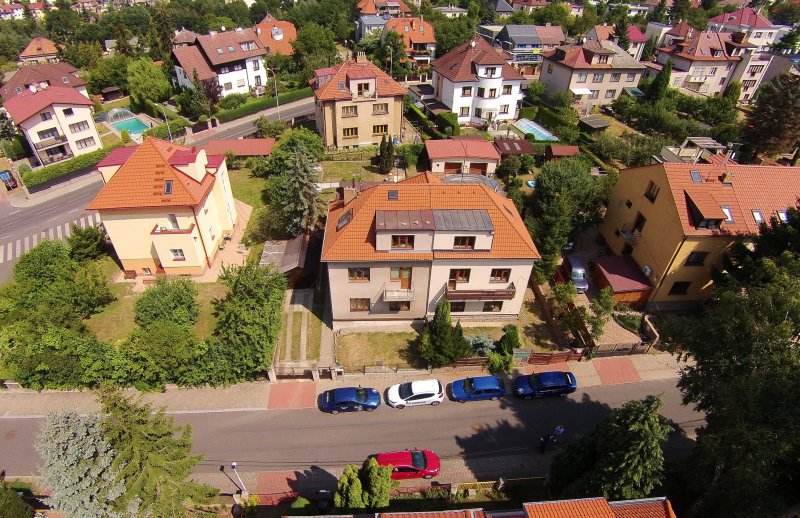{height="500"}

::: footer
[Source](https://www.geo5.cz/reference_reality_praha-4-hodkovicky-vila-v-ulici-korandova)
:::

---

#### Coherent Dense Adjacent Fabric

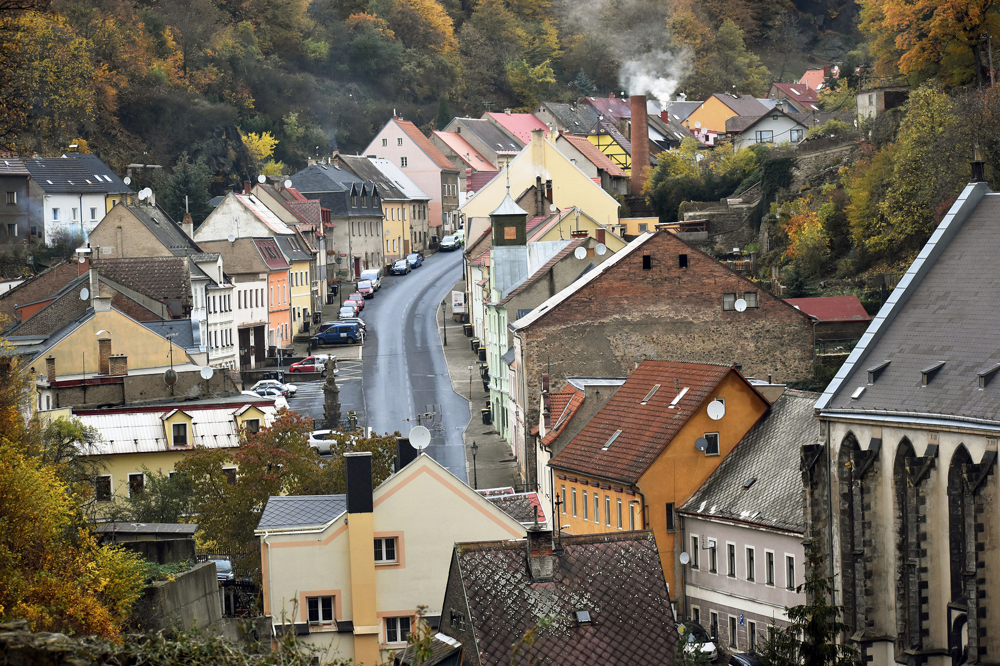{height="500"}

::: footer
[Source](https://teplicky.denik.cz/zpravy_region/krupka-obvineni-zastupitele-20210701.html)
:::

---

#### Incoherent Small-scale Linear Fabric

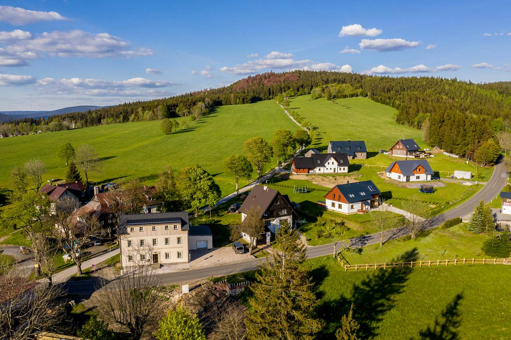{height="500"}

::: footer
[Source](https://www.e-chalupy.cz/jizerske_hory/_6578/apartman-je-hned-u-cesty-na-hvezdu-40d5-.jpeg)
:::

---

#### Incoherent Small-scale Sparse Fabric

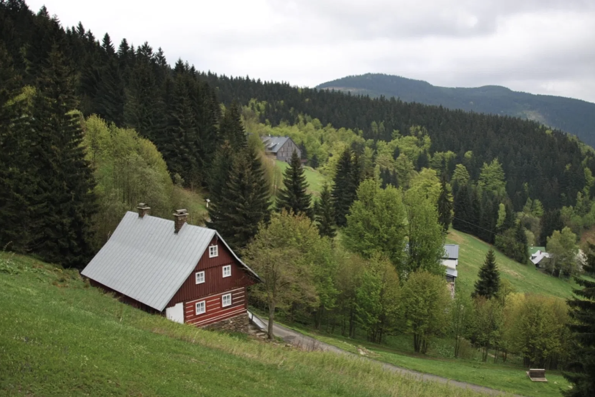{height="500"}

::: footer
[Source](https://svoboda-williams.com/prodej/rodinne-domy/detail/22750-horni-rokytnice)
:::

---

#### Incoherent Small-scale Compact Fabric

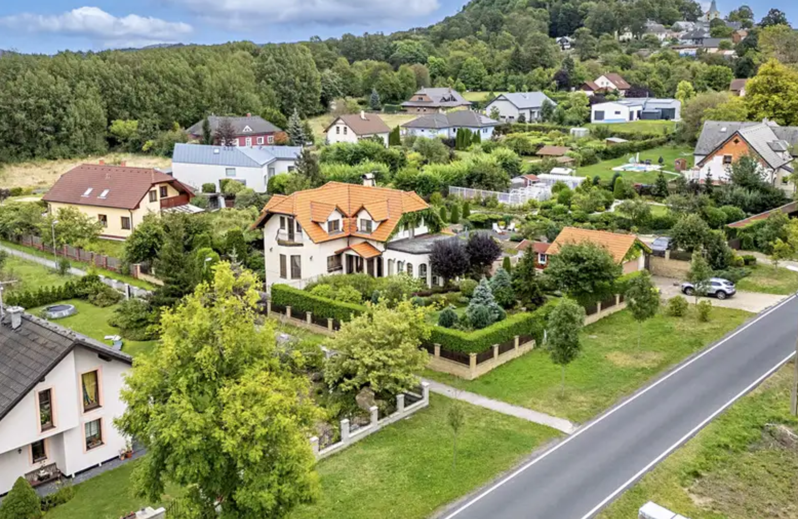{height="500"}

::: footer
[Source](https://d18-a.sdn.cz/d_18/c_img_oW_A/nO1SBfAluiD9J7zf4CQQFO4/edd1.jpeg?fl=res,800,600,3|shr,,20|webp,60)
:::

---

#### Incoherent Large-scale Homogeneous Fabric 

{height="500"}

::: footer
[Source](https://www.irozhlas.cz/ekonomika/na-prumerny-novy-byt-vydelava-prazan-11-5-roku-dele-nez-v-berline-bratislave-i-vidni_201609290829_pholinkova)
:::

---

## Scale {background-image="../figures/202602_urrlab_Anna/detail.png".no-text}

::: aside
Basic Settlement Units 

20 000 BSU in Czechia

Delineated based on urban fabric
:::

---

::: {.r-fit-text .absolute top=39%}
Census characterstics as the independent variables
:::

---

## Census variables

::: {.column width="50%"}

Population density

Age structure

Employment sector

Employment status

Dwelling ownership

:::

::: {.column width="50%"}

Education level

Household size

Citizenship

Religion

Marital status

:::

---

## Census processing

{.r-stretch}

---

## Global modelling with spatial crossvalidation

[Logistic Regression - 0.26]{.fragment}

[Random Forest Classification - 0.33]{.fragment}

---

#### Spatial Autocorrelation of the error

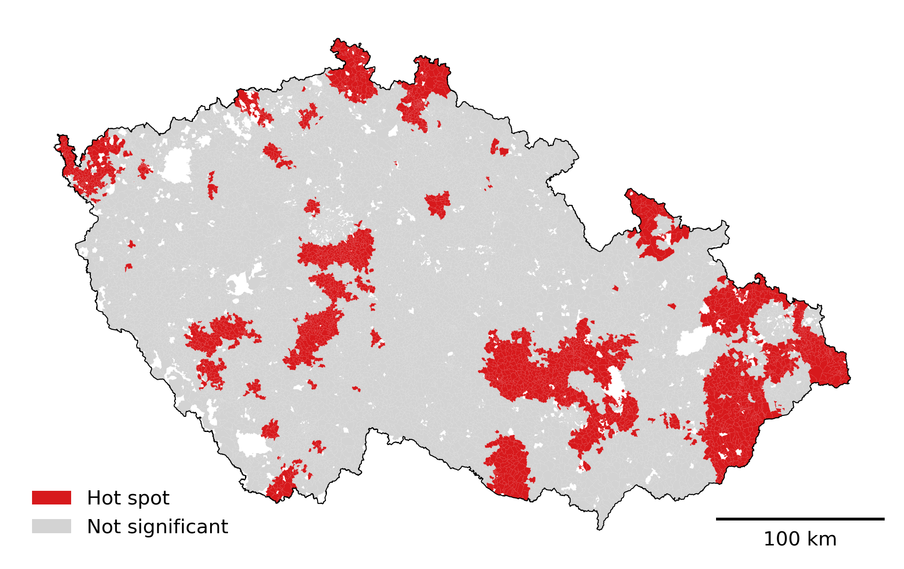{height="700"}

---

## Geographically weighted modelling

[Global models assume the same relationship between predictors and target classes across the entire dataset]{.fragment} 

[They do not account for the geographic variation in the relationship]{.fragment}

[Geographically weighted models capture this by applying local models rather than a single global model.]{.fragment}

---

## Geographically weighted classification

[Similar in concept to Geographically Weighted Regression (GWR).]{.fragment}

[Categorical or class-based outcomes.]{.fragment}

[Separate classifier for each location using data weighted by geographic proximity.]{.fragment}

---

### Weighting

::: {.column width="50%"}

Controlled by a distance-decay parameter.

Nearby observations are given more weight than distant ones.

:::

::: {.column width="50%"}

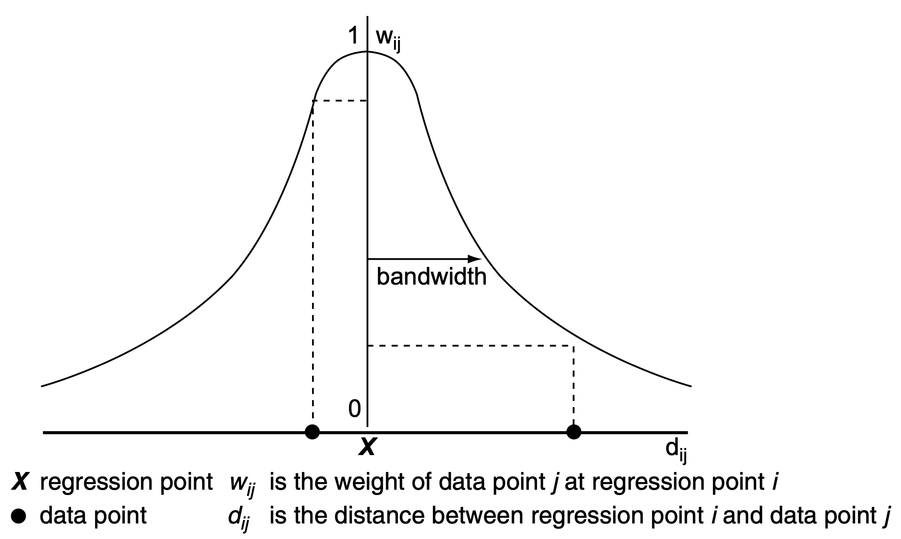{height="300"}

  Illustration of bandwidth and its relation to weight, Fotheringham et al. [(2002, 44–45)](https://www.researchgate.net/publication/27246972_Geographically_Weighted_Regression_The_Analysis_of_Spatially_Varying_Relationships)

:::

---

### Bandwidth 

Controls the spatial scale over which a process varies.

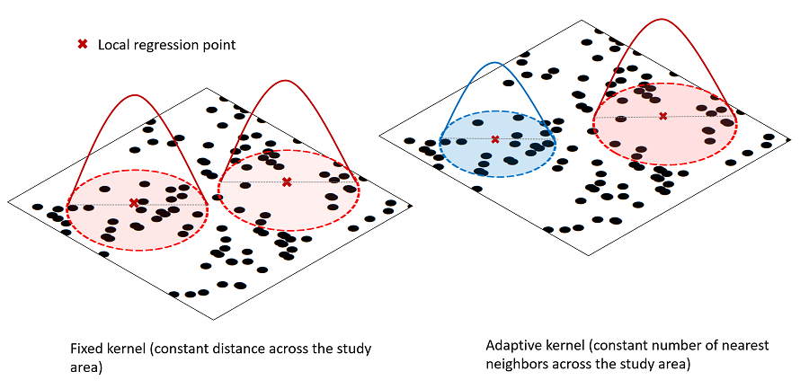{height="300"}

  Conceptual diagram explaining fixed (left) and adaptive weighting (right) schemes. Sachdeva, M., & Fotheringham, A. S. [(2020)](https://gistbok-topics.ucgis.org/AM-03-034s)

---

### Binary Classification

[The distribution of built form classes is uneven across space.]{.fragment}

[Some built forms do not appear in certain locations at all.]{.fragment}

[Each model can be tuned to local prevalence and have custom thresholds, weights, bandwidth...]{.fragment}

---

## Results {data-transition="none"}

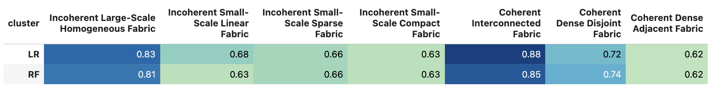{.r-stretch}

::: aside
Averaged F1-macro score.
:::

---

## Results {data-transition="none"}

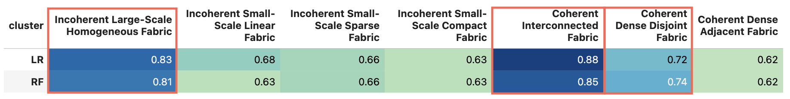{.r-stretch}

::: aside
Averaged F1-macro score.
:::

---

## Results {data-transition="none"}

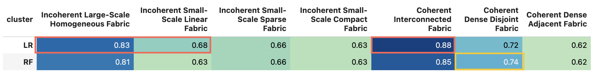{.r-stretch}

::: aside
Averaged F1-macro score.
:::

---

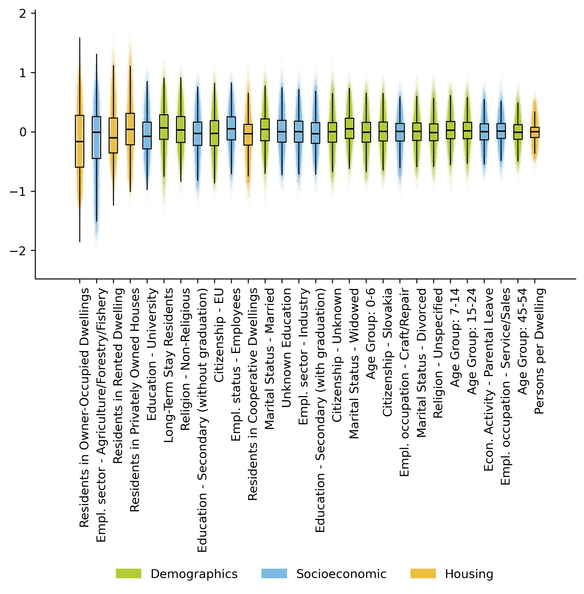{.r-stretch}

::: aside
Distribution of local coefficients ordered by their magnitude
:::

---

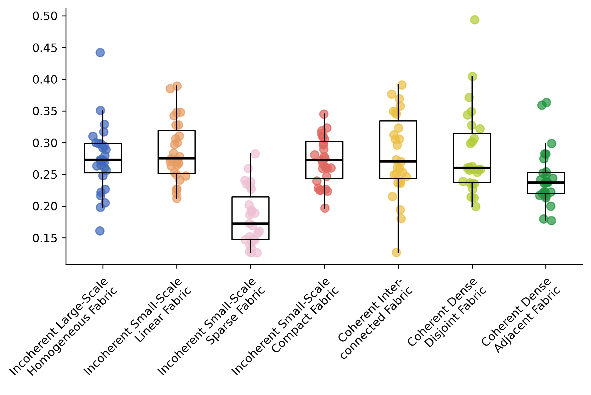{.r-stretch}

::: aside
Distribution of standard deviations of local coefficients by fabric type
:::

---

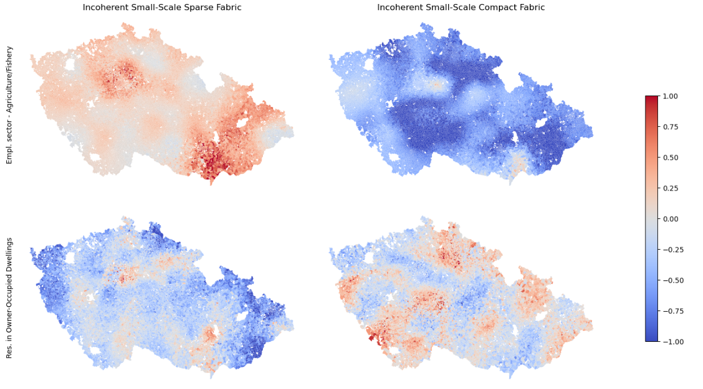{.r-stretch}

::: aside

:::

---

## Conclusion

[Relationship is influenced by spatial context by also by the typology of built form.]{.fragment}

[Relationship is not uniform and differs geographically – locally linear]{.fragment}

[Certain built form types are more socially selective than others and attract populations with specific profiles.]{.fragment}

[Housing tenure among the most important variables.]{.fragment}

# Thank you
