# What is hierarchical morphotope classification?

## Idea of a morphotope

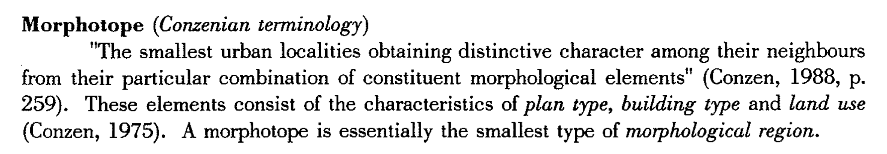{.fragment}

::: aside
[excerpt from Larkham and Jones, 1991]{.fragment}
:::

---

## How to capture it {.question}

---

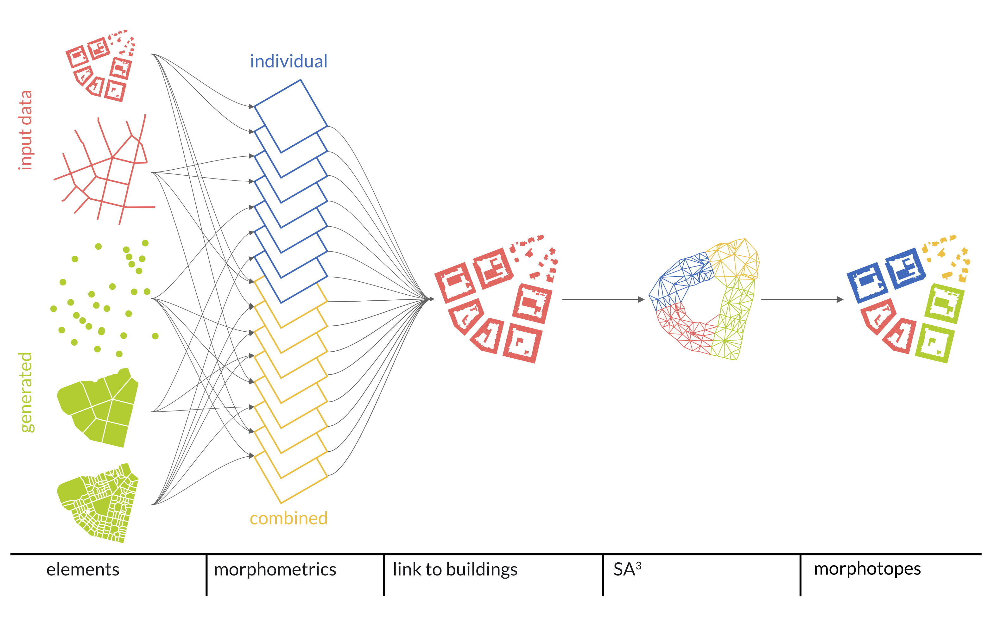

::: aside
Diagram illustrating a procedure to derive morphotopes using Spatial Adaptive Agglomerative Aggregation ($SA^3$)
:::

---

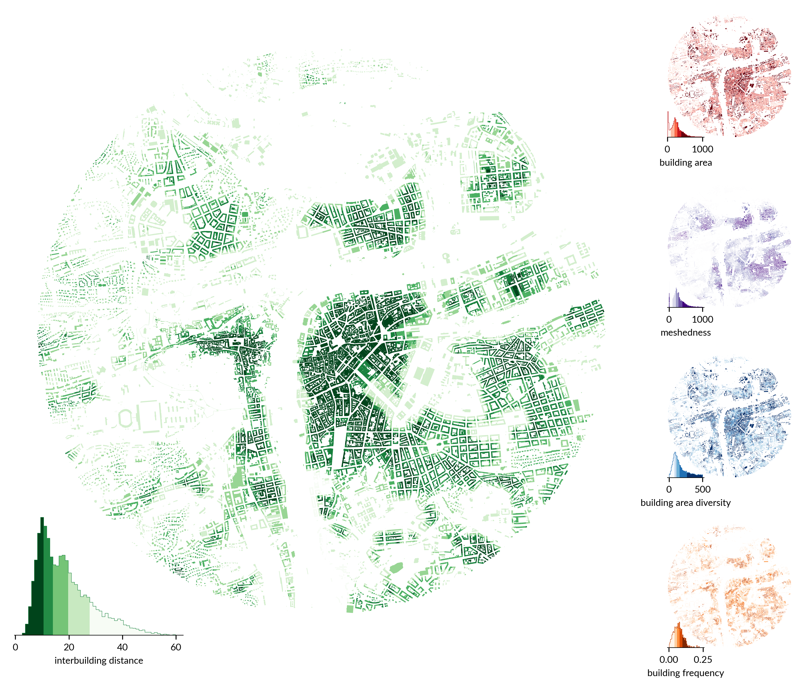{fig-align="center" width=75%}

::: aside
5 out of 54 morphometric characters illustrated on the Prague City Centre
:::

---

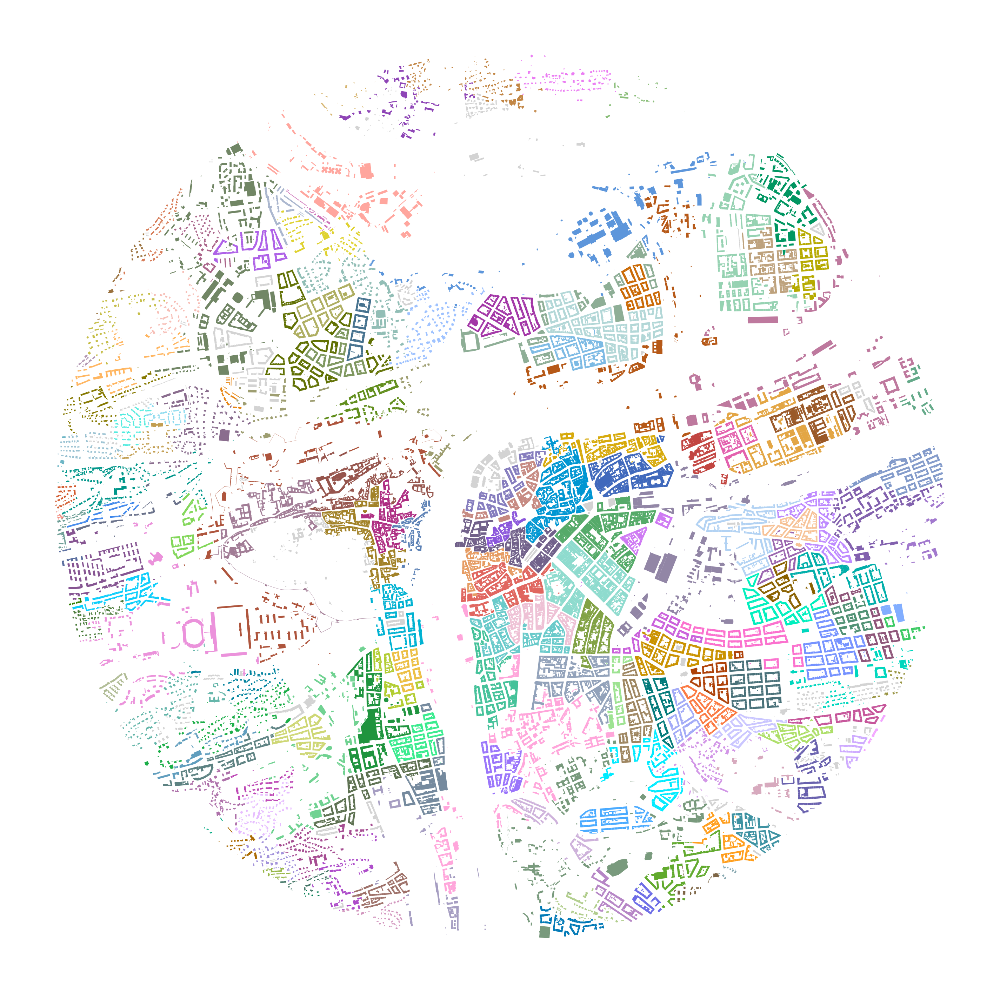{fig-align="center" width=65%}

::: aside
Morphotope delineation illustrated on the Prague City Centre
:::

---

::: {.r-fit-text .absolute top=39%}
Flexible definition of built-up fabric
:::

---

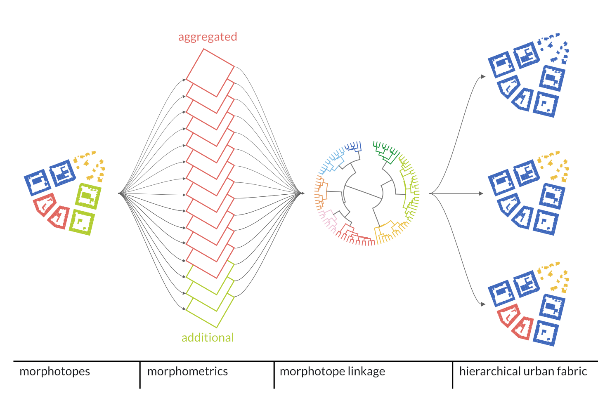{fig-align="center" width=90%}

::: aside
Diagram illustrating a procedure to derive Hierarchical Morphotope Classification (HiMoC)
:::

---

## {background-image="../figures/202511_ILUS/taxonomy.png" background-size="contain" .no-text}

## {background-image="../figures/202511_ILUS/taxonomy_tree.png" background-size="contain" .no-text}

## {background-image="../figures/202511_ILUS/taxonomy_chars.png" background-size="contain" .no-text}

## {background-image="../figures/202511_ILUS/taxonomy_abundance.png" background-size="contain" .no-text}

## {background-image="../figures/202511_ILUS/taxonomy_mtopes.png" background-size="contain" .no-text}

## {background-image="../figures/202511_ILUS/taxonomy.png" background-size="contain" .no-text}

---

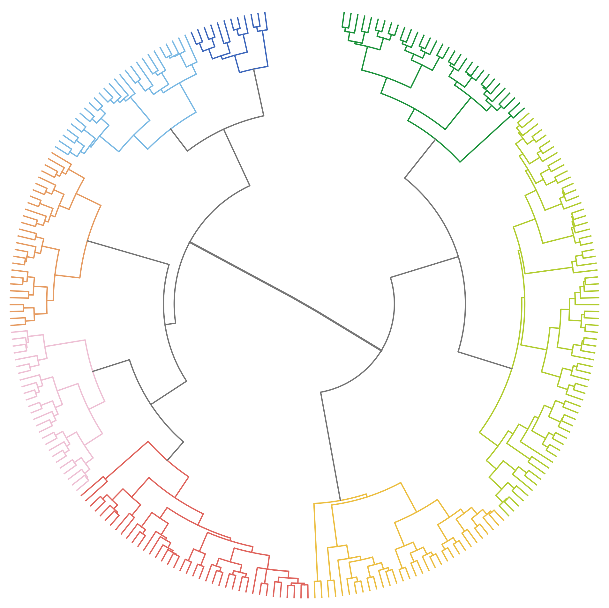{fig-align="center" width=60%}

::: aside
Taxonomic tree (up to 256 branches)
:::

---

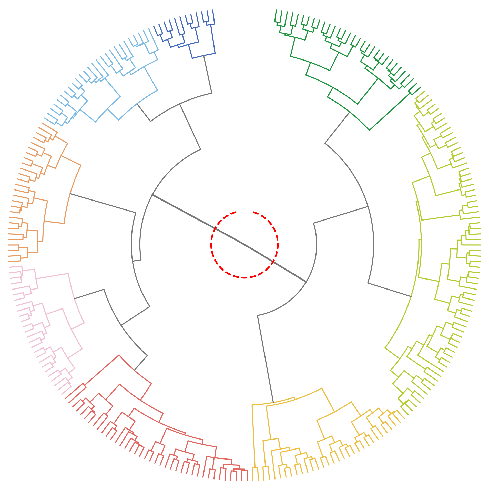{fig-align="center" width=60%}

::: aside
Taxonomic tree with a cut marking 2 branches (level 1)
:::

## {background-image="../figures/202511_ILUS/examples_1.png" background-size="contain" .no-text}

::: aside
Illustration of different levels of the hierarchy.
:::

---

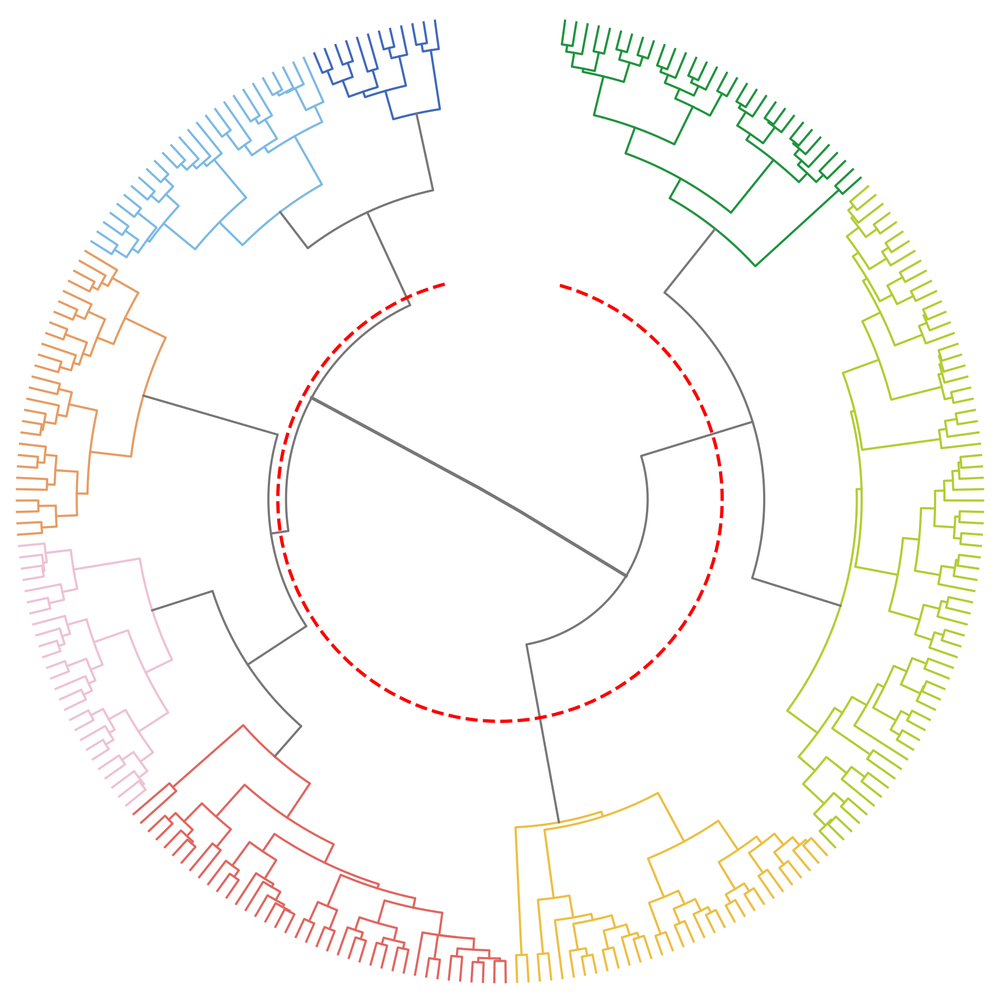{fig-align="center" width=60%}

::: aside
Taxonomic tree with a cut marking 4 branches (level 2)
:::

## {background-image="../figures/202511_ILUS/examples_2.png" background-size="contain" .no-text}

::: aside
Illustration of different levels of the hierarchy.
:::

---

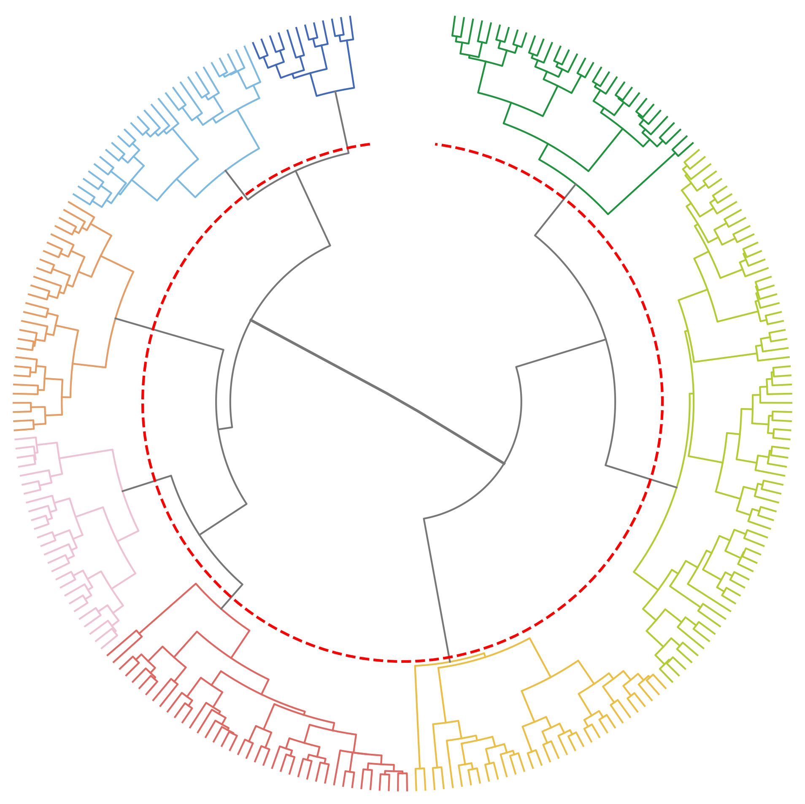{fig-align="center" width=60%}

::: aside
Taxonomic tree with a cut marking 8 branches (level 3)
:::

## {background-image="../figures/202506_ISUF/examples.png" background-size="contain" .no-text}

::: aside
Illustration of different levels of the hierarchy.
:::

# Geography and urban structure

---

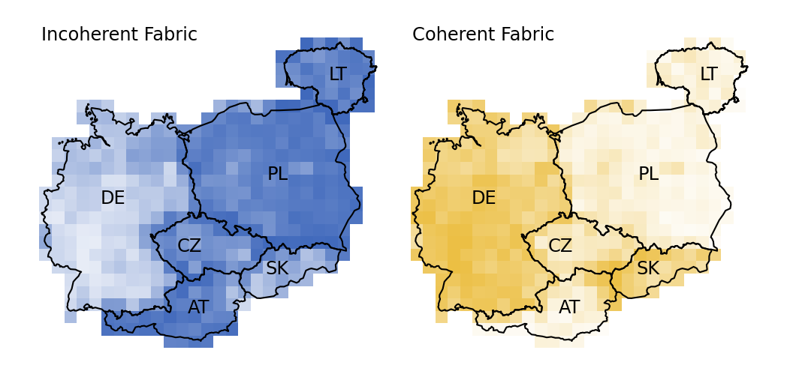{fig-align="center" width=50%}

::: aside
Abundance of built fabric types derived from level 1
:::

---

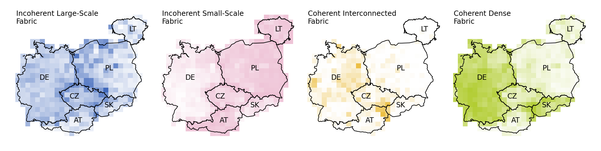{fig-align="center"}

::: aside
Abundance of built fabric types derived from level 2
:::

---

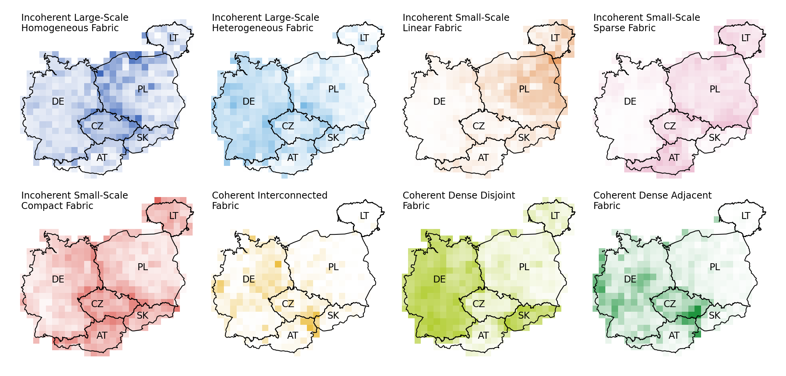{fig-align="center"}

::: aside
Abundance of built fabric types derived from level 3
:::

---

## {background-image="../figures/202511_ILUS/europe.png" background-size="fill" .no-text}

---

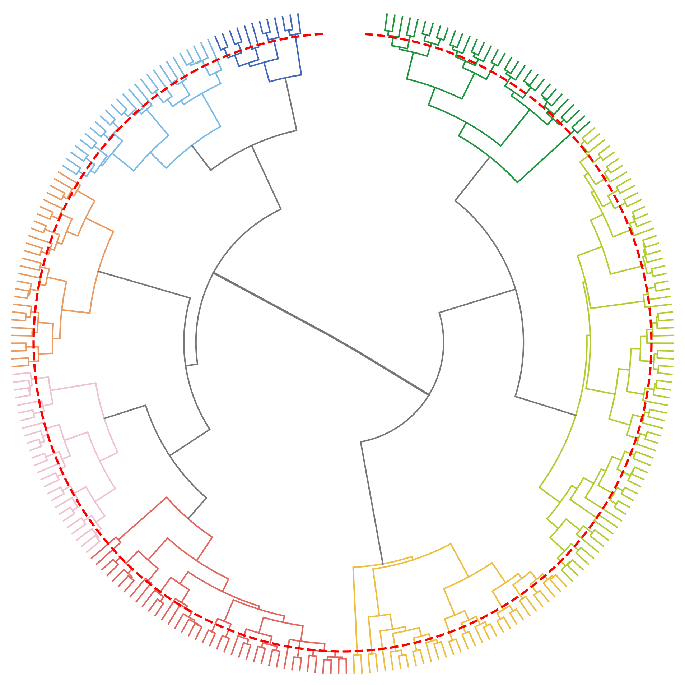{fig-align="center" width=60%}

::: aside
Taxonomic tree with a cut marking 107 branches (level 7)
:::

## {background-image="../figures/202511_ILUS/branch_proportions.png" background-size="contain" .no-text}

---

::: {.r-fit-text .absolute top=39%}
Compression to 2 dimensions using UMAP
:::

---

## {background-image="../figures/202511_ILUS/umap_components.png" background-size="contain" .no-text data-transition="none"}

::: aside
UMAP components reflecting the composition within 50km grid.
:::

---

## {background-image="../figures/202511_ILUS/umap.png" background-size="contain" .no-text data-transition="none"}

::: aside
Projection of UMAP components
:::

---

## {background-image="../figures/202511_ILUS/umap_eastern_germany.png" background-size="contain" .no-text data-transition="none"}

::: aside
Projection of UMAP components
:::

---

## {background-image="../figures/202511_ILUS/umap_eastern-poland.png" background-size="contain" .no-text data-transition="none"}

::: aside
Projection of UMAP components
:::

---

## {background-image="../figures/202511_ILUS/umap_pl_outliers.png" background-size="contain" .no-text data-transition="none"}

::: aside
Projection of UMAP components
:::

---

## {background-image="../figures/202511_ILUS/umap_cz-pl.png" background-size="contain" .no-text data-transition="none"}

::: aside
Projection of UMAP components
:::

---

## {background-image="../figures/202511_ILUS/umap_galicia.png" background-size="contain" .no-text data-transition="none"}

::: aside
Projection of UMAP components
:::

---

## {background-image="../figures/202511_ILUS/umap_be.png" background-size="contain" .no-text data-transition="none"}

::: aside
Projection of UMAP components
:::

---

## {background-image="../figures/202511_ILUS/umap_be_top.png" background-size="contain" .no-text data-transition="none"}

::: aside
Projection of UMAP components
:::

---

## {background-image="../figures/202511_ILUS/umap_be_mid.png" background-size="contain" .no-text data-transition="none"}

::: aside
Projection of UMAP components
:::

---

## {background-image="../figures/202511_ILUS/umap_be_nl.png" background-size="contain" .no-text data-transition="none"}

::: aside
Projection of UMAP components
:::

## {background-image="../figures/202511_ILUS/belgium.png" background-size="fill" .no-text}

# Take home points

---

::: {.r-fit-text .absolute top=39%}
Times have changed. Methods have changed. Concepts? Those only evolved.
:::

---

::: {.r-fit-text .absolute top=39%}
Urban morphology can be deeply embedded in spatial data science.
:::

---

::: {.r-fit-text .absolute top=39%}
Urban morphometrics can support quantitative studies done at scale.
:::

---

::: {.r-fit-text .absolute top=39%}
Structure of cities is deeply affected by culture and politics.
:::

---

::: {.r-fit-text .absolute top=39%}
We can ask questions like never before.
:::

---

## Do you want to follow up {.question}

[](https://uscuni.org/talks/slides/202511_ILUS.html) uscuni.org/talks

[](https://urbantaxonomy.org) urbantaxonomy.org

[](https://github.com/uscuni/urban_taxonomy) github.com/uscuni/urban_taxonomy

[](mailto:martin.fleischmann@natur.cuni.cz) martin.fleischmann@natur.cuni.cz

[](https://martinfleischmann.net) martinfleischmann.net

::: aside
The authors kindly acknowledge funding by the Charles University’s Primus programme through the project "Influence of Socioeconomic and Cultural Factors on Urban Structure in Central Europe", project reference `PRIMUS/24/SCI/023`.
:::