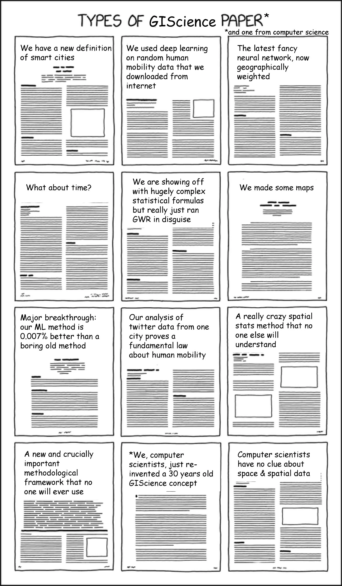
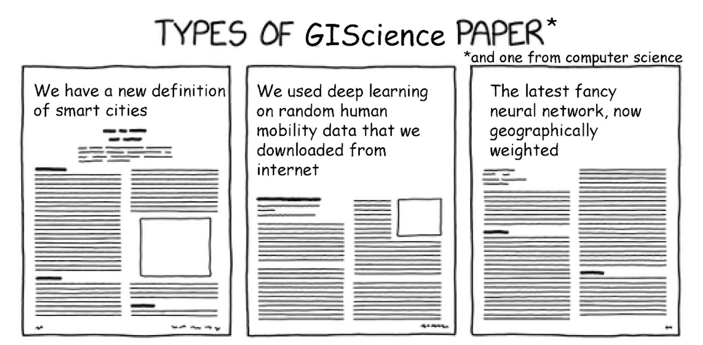
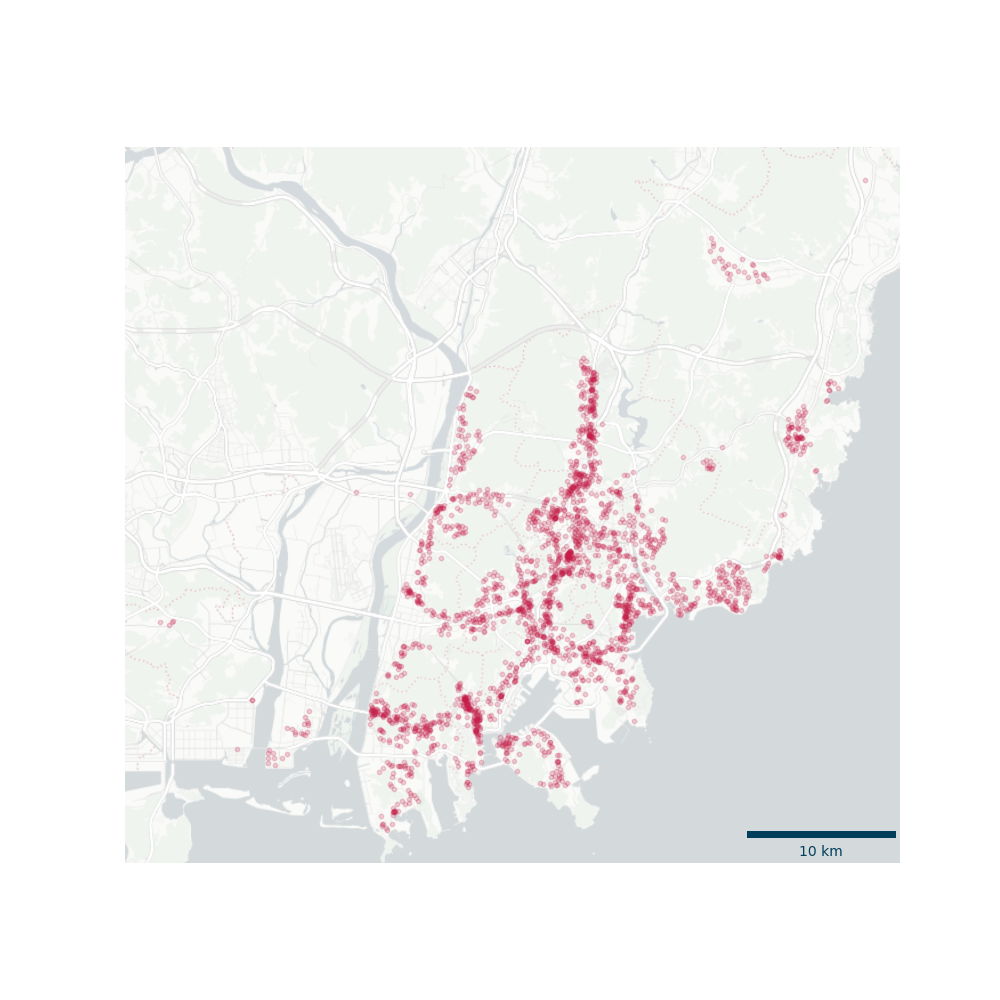
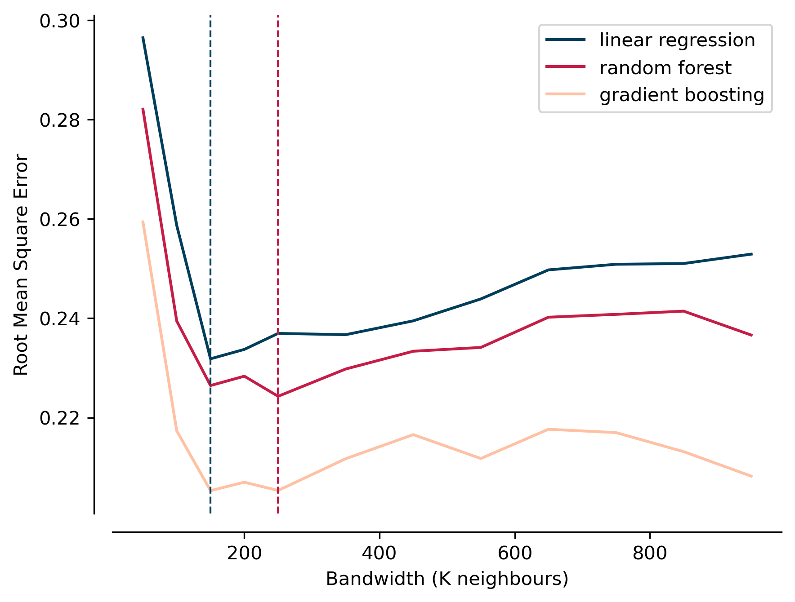
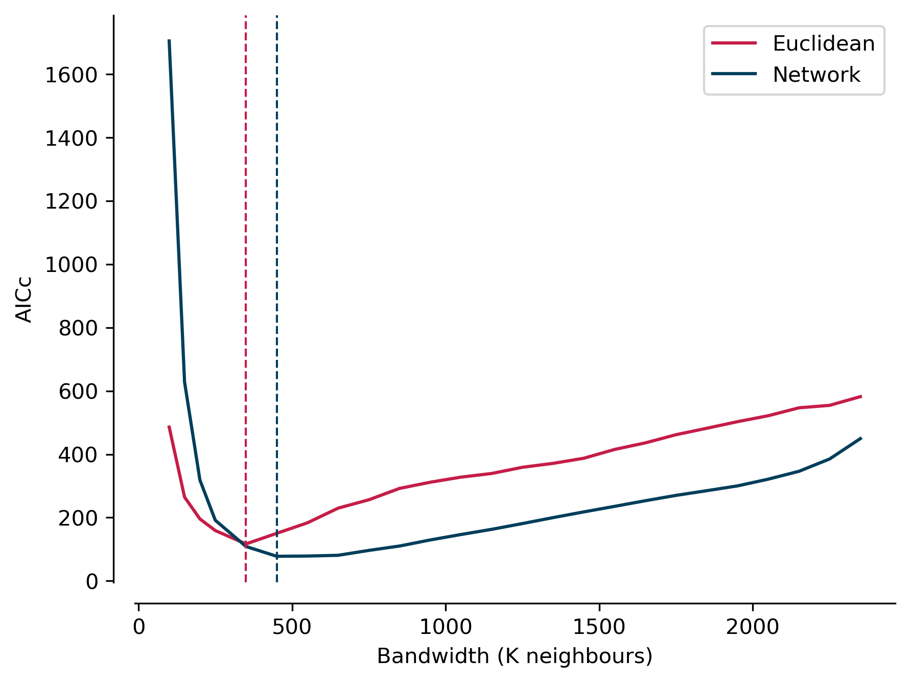
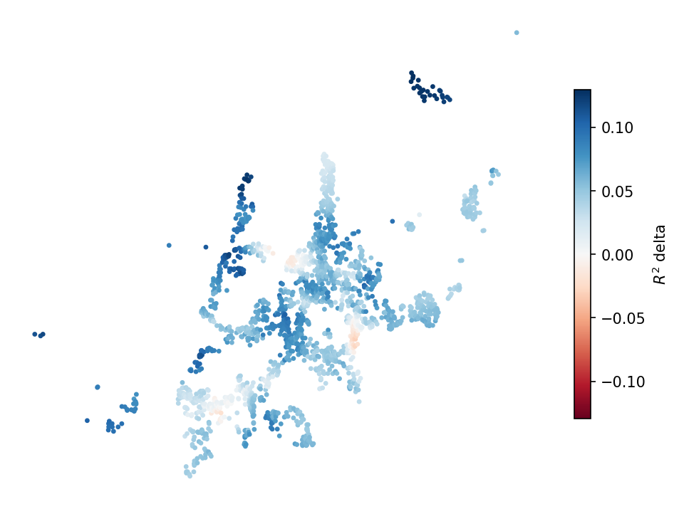
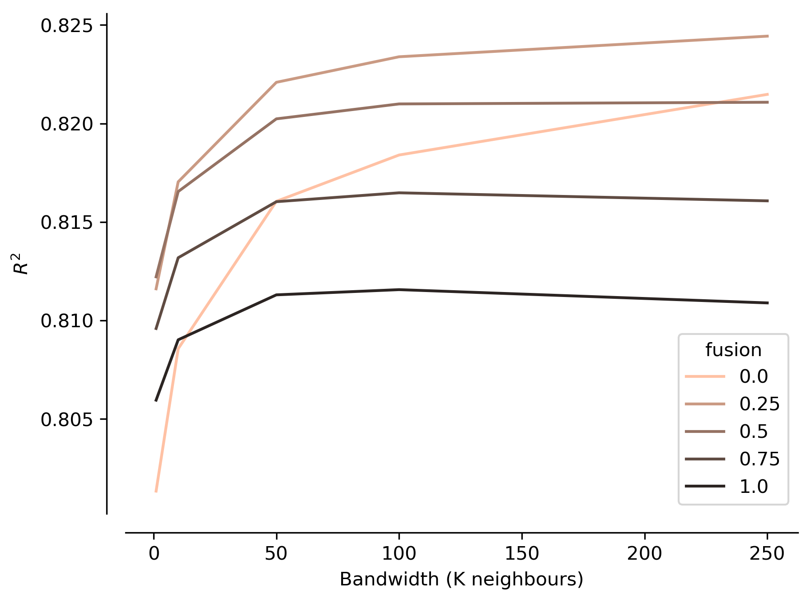

::: {.r-fit-text .absolute top=39%}
Spatial non-stationarity is hard.
:::

---

::: {.r-fit-text .absolute top=39%}
A common solution?
:::

---

::: {.r-fit-text .absolute top=39%}
Geographically Weighted Regression
:::

---

::: {.r-fit-text .absolute top=39%}
What about non-linear models?
:::

---

::: {.r-fit-text .absolute top=25%}
Most ML implementations are aspatial.
:::

::: {.r-fit-text .absolute top=45% .fragment}
Most spatial models remain linear.
:::

---

::: {.r-fit-text .absolute top=39%}
ad-hoc “localising” of specific algorithms
:::

---

---

---

::: {.r-fit-text .absolute top=39%}
_“the (not any longer) reproducible code lives in this (forgotten) repository”_
:::

---

::: {.r-fit-text .absolute top=39%}
There is no unified framework that generalises _“Geographically Weighted”_ logic.
:::

# gwlearn

[An agnostic framework for geographically weighted learning.]{.fragment}
[Written in Python.]{.fragment}

---

::: {.r-fit-text .absolute top=20%}
agnostic
:::

::: {.columns .absolute top=70%}
::: {.column .fragment}
neighbourhood definition
:::
::: {.column .fragment}
local estimator
:::
:::
<!-- end columns -->

# Flexible Definitions of Neighbourhoods

---

::: {.r-fit-text .absolute top=25%}
Traditionally defined by Euclidean distance.
:::

::: {.r-fit-text .absolute top=45% .fragment}
Fixed or adaptive (KNN) bandwidth.
:::

---

::: {.r-fit-text .absolute top=39%}
What about other ways?
:::

---

::: {.r-fit-text .absolute top=39%}
`gwlearn` allows custom graphs.
:::

---

::: {.r-fit-text .absolute top=10%}
network travel time
:::
::: {.r-fit-text .absolute top=39% .fragment}
space-time neighbourhoods
:::
::: {.r-fit-text .absolute top=60% .fragment}
topology of polygon contiguity 
...
:::

# Custom local estimator

---

::: {.r-fit-text .absolute top=20%}
Typically OLS.
:::

::: {.r-fit-text .absolute top=50% .fragment}
Occasionally something fancier.
:::

---

::: {.r-fit-text .absolute top=39%}
`gwlearn` supports any estimator.
:::

---

### Formally
$$
\hat{\theta}(u_i) = \operatorname*{argmin}_{\theta} \sum_{j=1}^{N} w_{ij}(u_i) \cdot \mathcal{L}\Big(y_j, f(X_j, \theta)\Big)
$$

- $\hat{\theta}(u_i)$ model parameters specific to location $u_i$,
- $w_{ij}(u_i)$ spatial weights of data point $j$ relative to location $(u_i)$,
- ​​$\mathcal{L}$ the loss function of the model,
- $f(X_j, \theta)$ the base estimator's prediction function.

---

::: {.r-fit-text .absolute top=10%}
linear regression
:::
::: {.r-fit-text .absolute top=39% .fragment}
random forest regressor
:::
::: {.r-fit-text .absolute top=60% .fragment}
gradient boosted classifier 
...
:::

# gwlearn architecture

---

::: {.r-fit-text .absolute top=5%}
modularity
:::

::: {.r-fit-text .absolute top=35% .fragment}
interoperability
:::

::: {.r-fit-text .absolute top=60% .fragment}
flexibility
:::

## Spatial weights graphs

[Defined in `libpysal.graph.Graph` created prior model fitting.]{.fragment}

## scikit-learn compatibility

[Any model with `scikit-learn` compatible API can be used.]{.fragment}

[`gwlearn`'s estimators define `scikit-learn` compatible API.]{.fragment}

## Spatial prediction

[Training set of local models is as a reusable spatial ensemble.]{.fragment}

[Three inference strategies:]{.fragment}

::: {.incremental}

- _Nearest Local Mode_
- _Spatial Ensemble_
- _Global Model Fusion_

:::

# Example

Housing price in Busan.

> An, S., Jang, H., Kim, H. et al. Assessment of street-level greenness and its association with housing prices in a metropolitan area. _Sci Rep_ 13, 22577 (2023). [https://doi.org/10.1038/s41598-023-49845-0](https://doi.org/10.1038/s41598-023-49845-0)

---

{fig-align="center"}

## Case 1 - models

---

{fig-align="center"}

## Case 2 - graphs

---

## {background-image="../figures/202604_GISRUK/euclidean_knn.png" background-size=80% .no-text}

::: aside
Euclidean KNN graph at 150 neighbours
:::

---

## {background-image="../figures/202604_GISRUK/newtork_knn.png" background-size=80% .no-text}

::: aside
Street network KNN graph at 150 neighbours
:::

---

## {background-image="../figures/202604_GISRUK/graphs.png" background-size=80% .no-text}

::: aside
Overlap of both KNN graphs
:::

---

{fig-align="center"}

---

{fig-align="center"}

## Case 3 - predictions

---

{fig-align="center"}

---

::: {.r-fit-text .absolute top=39%}
`gwlearn` provides the infrastructure
:::

---

::: {.r-fit-text .absolute top=39%}
computation remains a bottleneck
:::

---

::: {.r-fit-text .absolute top=20%}
`gwlearn` provides the missing link between the rich tradition of GWR 
and the modern machine learning ecosystem.
:::

---

::: {.r-fit-text .absolute top=39%}
pysal.org/gwlearn
:::

---

## Do you want to follow up {.question}

[](https://pysal.org/gwlearn) pysal.org/gwlearn

[](https://github.com/pysal/gwlearn) github.com/pysal/gwlearn

[](https://uscuni.org/talks/slides/202604_GISRUK_gwlearn.html) uscuni.org/talks

[](mailto:martin.fleischmann@natur.cuni.cz) martin.fleischmann@natur.cuni.cz

[](https://martinfleischmann.net) martinfleischmann.net

::: aside
The author kindly acknowledges funding by the Charles University’s Primus programme through the project "Influence of Socioeconomic and Cultural Factors on Urban Structure in Central Europe", project reference `PRIMUS/24/SCI/023`.
:::